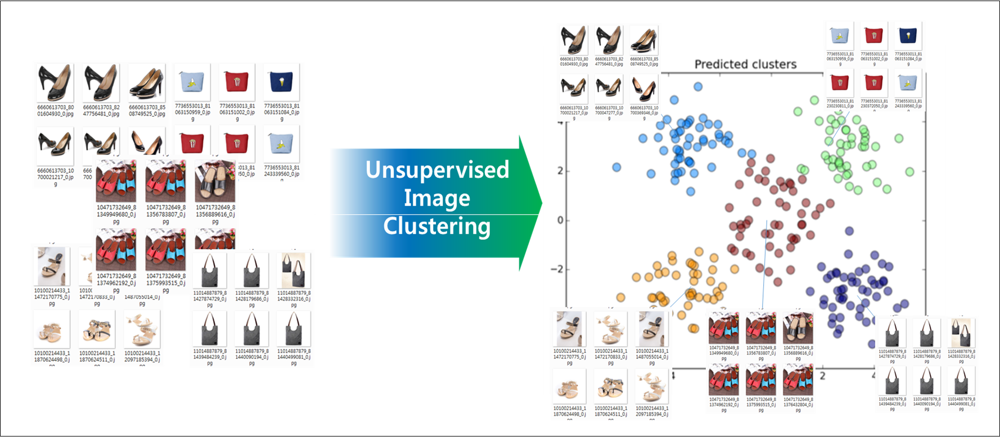
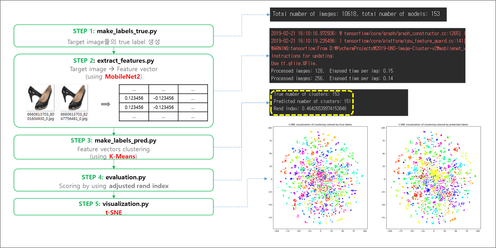
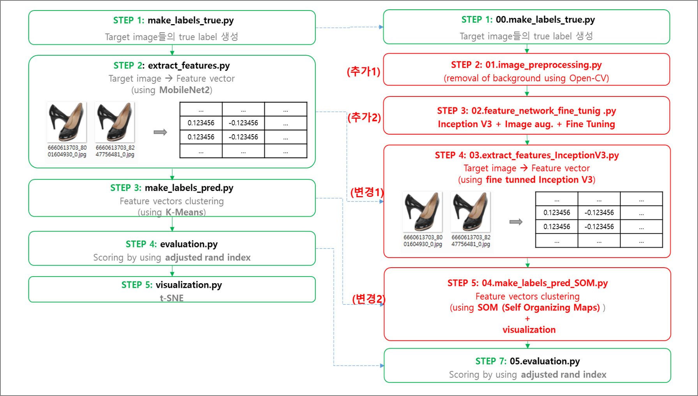
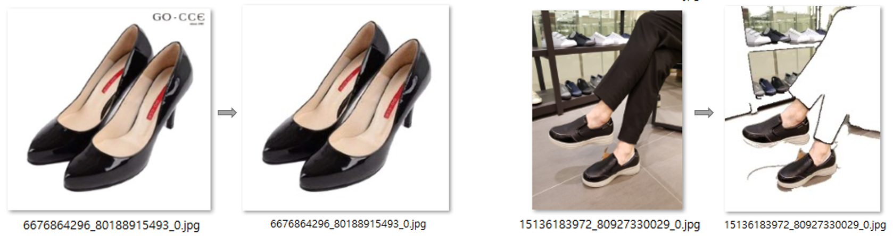

# 2019 6th D2 CampusFest Image Clustering (지정주제)
## 00. 지정주제(Unsupervised Image Clustering) 개요
```
- 다수의 비분류된 상품 이미지들을 대상으로 Unsupervised Clustering 작업 수행
- 상품 이미지들의 특징을 추출하고 클러스터링 정확도를 올리는 것이 최종 목표 
- 최종 테스트에서는 Cluster number 또한 예측 
```


(참고: 네이버의 대회 참가용 이미지 공유 정책에 따라 실제 테스트 데이터 이미지는 본 github에 공유하지 않았습니다.)
 
&nbsp;
## 01. Base line code 분석
```
- /original_src/ 폴더의 소스
- 아래의 이미지의 step별로 소스를 실행할 경우 시연 가능
- config.py 에서 이미지 소스 경로변경은 필요
```

 
&nbsp;
## 02. New Clustering model 
```
- 특징
01. 상품이미지의 배경을 Open-CV를 이용하여 제거하는 이미지 전처리 단계 추가
02. Pre-trained feature extraction model을 fine-tunning (기존에 true값을 알고 있는 상품이미지 class를 추가 training)
03. fine-tunned model을 이용하여 image feature vector extraction
04. Dimenstion reduction(차원 감소) 없이 clustering 가능한 SOM (Self Organizing Map) 알고리즘을 이용하여 Clustering
```


&nbsp;
## 03. How to evaluate New Clustering model 
```
- 이미지 전처리 과정이 추가됨으로써 아래 파일들을 실행하기 전에 config.py에 다음이 추가됨
- 원본 이미지가 있는 폴더와 전처리 완료한 이미지가 있는 폴더를 구분 해야 
# output dirs
RAW_IMG_DIR = "./raw_img/" + DATASET   # 원본 이미지 파일 경로
IMG_DIR = "./img/" + DATASET           # 전처리 완료한 이미지 파일 경로
```


>### 03.0 True label making
```
- how to run: python3 00.make_lables_true.py
```
&nbsp;

>### 03.1 Image pre-processing
```
- 상품이미지의 배경을 Open-CV를 이용하여 제거하는 이미지 전처리 단계
- 원분 이미지 파일이 저장되는 곳 = "./raw_img/" + DATASET   
- 전처리 완료된 같은 파일명의 파일이 저장되는 곳 = IMG_DIR = "./img/" + DATASET  
- how to run: python3 01.img_preprocess.py
````


&nbsp;

>### 03.2 Feature vectorizing model fine tuning
```
- Fine tuning a pre-trained feature vectorizing model (inception_v3)
- 기존의 true class를 알고 있는 이미지를 이용하여 pre-train 모델에 class를 추가
- Image augmentation + Fine-tunning a network
- Finie tunning을 위해 아래와 같이 우선 class별 subfolder를 만든 후 network를 실행한다
- how to run 1st: python3 make_traning_image_folders.py
- how to run 2nd: python3 02.feature_network_fine_tunig .py
```

&nbsp;

>### 02.3 Feature extraction (결승전까지 비공개)
- Feature extraction using fine tuned network model 

&nbsp;
>### 02.4 Clustering
- Another clustering model (결승전까지 비공개)

&nbsp;
>### 02.5 Evaluation
- evaluation.py

&nbsp;
>### 02.6 Visualization

